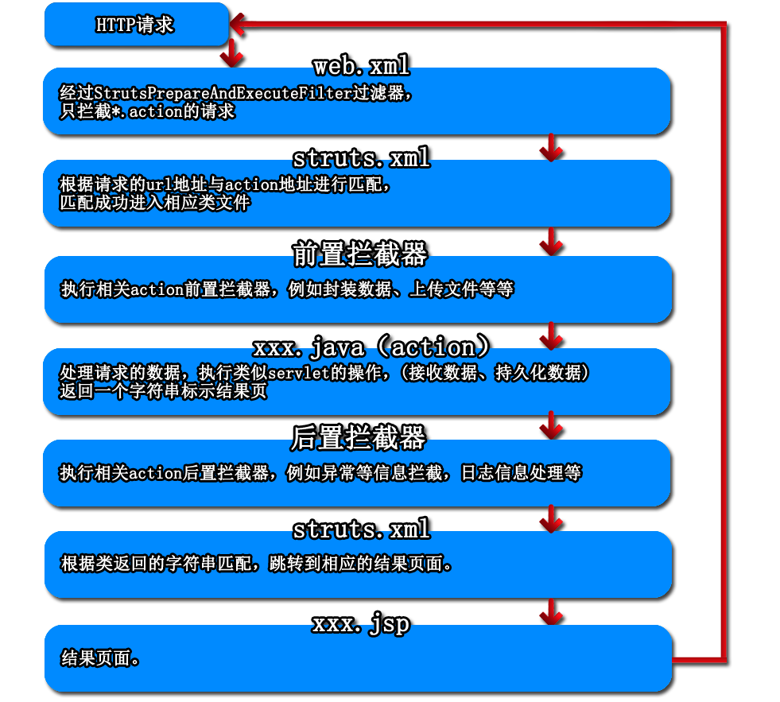
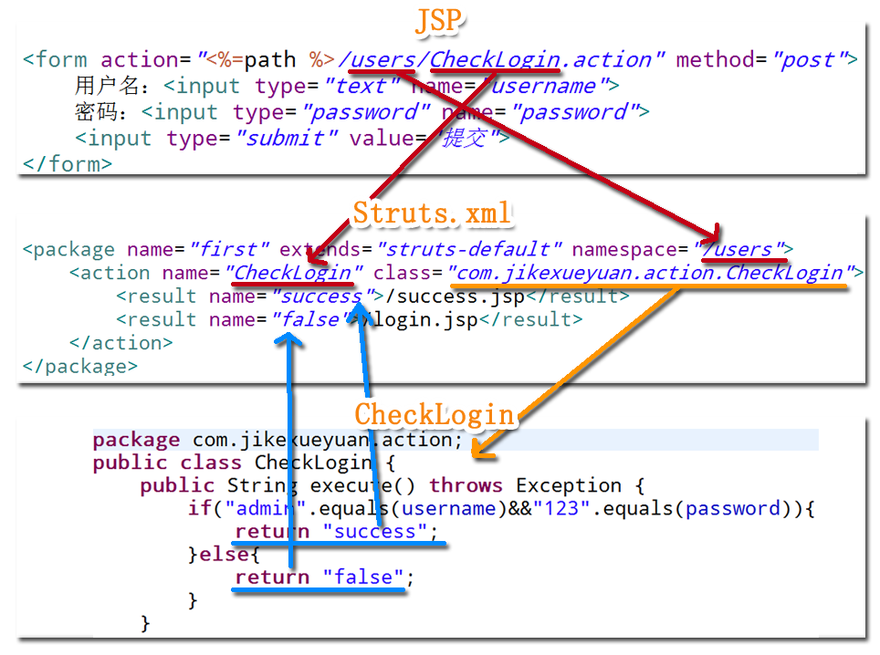

### Struts2

1. 创建与包导入

   参考：https://www.jianshu.com/p/ef5b9ed1cdb8

   也可以参考视频：https://www.jikexueyuan.com/course/697.html

   * **手动导入支持包创建**
     * 把依赖包（可以用官方给的示例解压得到）放入lib目录下
     * 把struts.xml复制到src文件夹下
       * 如果联网会自动导入dtd文件
       * 也可以手动导入dtd文件（xml catalog）
     * 在web.xml配置核心过滤器及映射文件
   * **自动通过IDE创建**

2. 不自动生成web.xml的问题

   参考：https://blog.csdn.net/smallbabylong/article/details/78726503

3. 配置文件解析（struts2-2）

   * 概览

     ```xml
     <!--配置根元素-->
     <struts>
         <!--bean 标签用于创建一个javabean实例-->
         <!--constant标签用于Struts2默认行为标签-->
         <!--package标签包标签 用于区分不同的请求文件的标签
            比如：网站前台请求 网站后台请求-->
         <!--include标签用于引入其他的xml配置文件-->
     </struts>
     ```

   * constant标签

     ```xml
     <!--配置web默认编码集 相当于HttpServletRequest。setCharacterEncoding用法-->
     <constant name="struts.i18n.encoding" value="UTF-8"></constant>
     <!--默认我们请求的后缀是.action(只拦截.action的请求)，如果不配置该元素，action/do都可以-->
     <constant name="struts.action.extension" value="action,do"></constant>
     <!--设置浏览器是否缓存静态内容，默认值是true，开发阶段建议使用false，防止修改后测试不到-->
     <constant name="struts.serve.static.browserCache" value="false"></constant>
     <!--当struts配置文件修改后是否自动重新加载，默认flase-->
     <constant name="struts.configuration.xml.reload" value="true"></constant>
     <!--开发模式下使用，可以打印出更加详细的错误信息-->
     <constant name="struts.devMode" value="true"></constant>
     <!--默认视图主题-->
     <constant name="struts.ui.theme" value="simple"></constant>
     ```

   * package

     ```xml
      <!--name属性：包名，用于被别的包调用或者继承
         extends:继承哪个包，会继承该包下配置信息和拦截器等等
         namespace：选填，url连接必须加入/new/action.xxx-->
     <package name="test" namespace="/new" extends="struts-default">
         <!--action相当于以前的servlet概念，对应一个请求的name为请求的url
            localhost:8080/login.do-->
         <action name="login" class="LoginAction">
             <result name="success">/success.jsp</result>
             <result name="fail">/fail.jsp</result>
         </action>
     </package>
     ```

4. 配置web.xml

   * 示例

     ```xml
     <welcome-file-list>
         <welcome-file>index.jsp</welcome-file>
     </welcome-file-list>
     <filter>
         <filter-name>filter</filter-name>
         <filter-class>org.apache.struts2.dispatcher.ng.filter.StrutsPrepareAndExecuteFilter</filter-class>
     </filter>
     <filter-mapping>
         <filter-name>filter</filter-name>
         <url-pattern>*</url-pattern>
     </filter-mapping>
     ```

5. 项目走转流程

   * Http请求流转

     

   * 配置文件连接点详述

     

   ​

6. 数据封装机制（struts2-3）

   * 属性和模型驱动

     * 传统方法

       ```java
       //传统方法代码量大 操作比较机械重复
       String username=request.getParameter("username");
       String password=request.getParameter("password");
       User user=new User(username,password);
       //struts2提供自动获取封装数据
       ```

     * 属性驱动（Struts2-3/action/LoginAction.java）

       **表单中的name值和action中属性的名称一致**

       LoginAction.java

       ```java
       public class LoginAction extends ActionSupport {
           private String username;
           private String password;
           @Override
           public String execute() throws Exception {
               System.out.println(username);
               System.out.println(password);
               return "success";
           }
       }
       ```

       struts.xml

       ```xml
       <package name="userLogin" extends="struts-default">
               <action name="loginAction" class="action.LoginAction">
                   <result name="success">/index.jsp</result>
               </action>
       </package>
       ```

       index.jsp

       ```jsp
       <form action="<%=path %>/loginAction.action" method="post">
         username:<input type="text" name="username"><br>
         password:<input type="password" name="password"><br>
         <input type="submit" value="提交">
       </form>
       ```

     * 模型驱动（Struts2-3/action/MLoginAction.java）

       编写pojo类

       MLoginAction.java(**实现ModelDriven\<T>接口 且实例化一个对象** )

       ```java
       public class MLoginAction extends ActionSupport implements ModelDriven<Users> {
           private Users user=new Users();
           @Override
           public String execute() throws Exception {
               System.out.println(user.getUsername());
               System.out.println(user.getPassword());
               return "success";
           }

           @Override
           public Users getModel() {
               return user;
           }
       }
       ```

       struts.xml(**引用两个拦截器**)

       ```xml
       <package name="userLogin" extends="struts-default">
           <action name="muserLogin" class="action.MLoginAction">
               <result name="success">/index.jsp</result>
               <interceptor-ref name="modelDriven"></interceptor-ref>
               <interceptor-ref name="defaultStack"></interceptor-ref>
           </action>
       </package>
       ```

     * 标签实现模型驱动（Struts2-3/action/SLoginAction.java）

       SLoginAction.java（**需要对象 但是不需要实例化**）

       ```java
       public class SLoginAction  extends ActionSupport{
           //无需实例化 但是需要实现getter setter
           private Users user;

           @Override
           public String execute() throws Exception {
               user.getUsername();
               user.getPassword();
               return "success";
           }
       }
       ```

       index.jsp(**引用struts标签库  action只需要写配置文件中的名字 不需要写全路径**)

       （**user.username 需要对应pojo类以及Action中实例的名字**）

       ```jsp
       <%--引用struts标签库--%>
       <%@ taglib prefix="s" uri="/struts-tags" %>

       <h1>标签模型驱动/h1>
         <%--action只需要写配置文件中的名字 不需要写全路径--%>
         <s:form namespace="/userlogin" action="suserlogin" method="post">
         <s:textfield name = "user.username"/>用户名：
         <s:password name = "user.password"/>密码：
         <s:submit value="提交"  />
       </s:form>
       ```

       struts.xml

       ```xml
       <package name="userLogin" extends="struts-default">
           <action name="suserLogin" class="action.SLoginAction">
               <result name="success">/index.jsp</result>
           </action>
       </package>
       ```

   * 封装数据核心机制

     反射方法的调用

     * 当请求发送到action前
     * 调用MLoginAction类中getModel()获取要将数据表单封装到哪个实例化的对象中
     * 获得该对象后，我们可以获得类的类型
     * 获得类的类型之后，获得类中的属性
     * request.getParameters获得表单提交的所有数据名，从而获得值
     * 如果表单提交的name值与实体类中的属性名一致，那么我们将获得表单中的数据 封装到user对象中去

     ​

