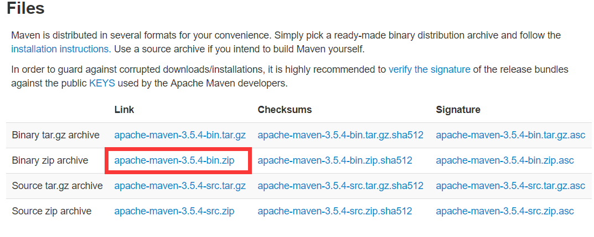

### Maven

1. 概述

   Maven是一个项目管理工具，提供构建的功能，还能提供代码的静态检查等

2. 功能

   * 构建项目(Builds)
   * 依赖管理
   * 配置管理
   * 发布管理
   * 文档编制
   * 报告

3. 特点

   * 微内核：大多数功能委派给插件来做，内核主要解析xml等
   * 约定优于配置
   * 项目模型

4. Windows安装

   * http://maven.apache.org 下载压缩包

     

   * 拷贝压缩包到指定目录并解压

   * 环境变量

     * 新建 M2_HOME，值为安装目录
     * PATH，值为%M2_HOME%\bin

   * mvn --version

5. 命令行构建Maven项目

   ```powershell
   mvn archetype:generate
   //根据模板创建 配置groupID 等
   mvn package
   //打包 在根目录下target文件夹中生成jar
   ```

   ​

   ​